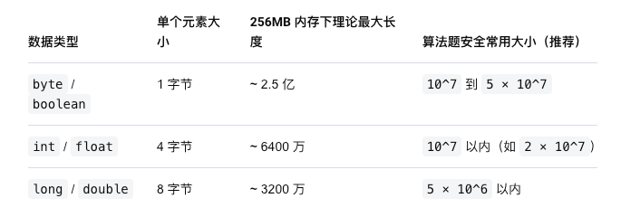

## 思维

### [L, R] 可以看作 [0, R] - [0, L - 1]

### 如果复杂度在10^6, 就可以暴力

### 什么时候考虑先排序,再进行处理

通常有三个信号：

1. **原数组顺序不重要**，只关心选择了哪些数。
2. 条件与**最大值、最小值、差值或倍数**有关。
3. 排序后条件具有**单调性**，可以使用双指针或滑动窗口。

#### 常见题型

- 任意删除或选择元素
- 找数值接近的一组元素
- 最大值与最小值满足限制
- 两数之和、三数之和
- 区间合并
- 贪心匹配

#### 适合“排序 + 滑动窗口”的情况

> 排序后，如果区间两端满足条件，那么加入中间元素也不会破坏条件。

#### 不能随便排序的情况

- 连续子数组
- 子序列
- 必须保持原顺序
- 依赖下标距离
- 相邻元素操作

#### 快速判断

1. 原顺序是否重要？
2. 排序后是否具有单调性？
3. 最优选择能否变成排序数组中的连续区间？

如果答案是：

- 原顺序不重要
- 排序后具有单调性
- 最优选择可以形成连续区间

通常可以考虑：

**排序 + 双指针/滑动窗口**


## 杂项

### 看到区间和就想到前缀和


### int范围

- **存储空间**：通常占用 4 个字节（32位）
- **有符号 `int` 范围**：`-2,147,483,648 ~ 2,147,483,647`（约 -2 × 10⁹ 到 2 × 10⁹）
- **无符号 `unsigned int` 范围**：`0 ~ 4,294,967,295`（即 0 到 2³²-1，约 4 × 10⁹）

### ACM检查

ACM 中可以养成下面的自测习惯：

- 全部相同：`[1,1,1,1]`
- 全部不同：`[1,2,3,4]`
- 重复元素刚好滑出：`[1,1,2]`
- 滑出的元素和新加入的元素相同
- `k = 1`
- `k = nums.length`
- `m = 1`
- `m = k`
- 没有合法窗口
- 最大数据，检查 `int` 溢出

### 数组大小



### 比较字符串字典序大小

```java
s1.compareTo(s2) < 0   // s1 小于 s2
s1.compareTo(s2) == 0  // 相等
s1.compareTo(s2) > 0   // s1 大于 s2
```

### map.get()比较, 不能用==，要用.equals()

HashMap` 返回的是 `Integer` 对象，`==` 可能比较对象地址，而不是数值。小数字因为 Java 的整数缓存可能碰巧正确，但字符出现次数超过 `127` 时可能出错。

```java
map1.get(ch).equals(map2.get(ch))
  
```

### 单调队列 vs优先队列

单调队列和 `PriorityQueue` 都可以维护最大值或最小值，但不能完全通用。

#### 对比

| 场景 | 单调队列 | PriorityQueue |
|---|---|---|
| 滑动窗口最大值、最小值 | 最合适，`O(n)` | 可以，`O(n log n)` |
| 元素按进入顺序过期 | 支持 | 需要下标和延迟删除 |
| 任意删除指定元素 | 不适合 | `remove` 是 `O(n)` |
| 获取全局最大值、最小值 | 限制较多 | 最合适 |
| 前 K 大、前 K 小 | 不支持 | 支持 |
| 第 K 大、第 K 小 | 不支持 | 支持 |
| 合并多个有序序列 | 不适合 | 最合适 |
| 动态中位数 | 不支持 | 可以使用两个堆 |
| 同时维护最大值和最小值 | 两个单调队列 | 大顶堆和小顶堆 |

#### 什么时候使用单调队列

**单调队列要求元素的值加入后保持不变，并按照窗口顺序过期**

满足以下条件时，优先考虑单调队列：

- 题目处理连续子数组或滑动窗口。
- 左右指针只向右移动。
- 元素按照进入窗口的顺序过期。
- 只需要窗口中的最大值或最小值。

典型题目：

- 滑动窗口最大值或最小值。
- 最长连续子数组，要求 `max - min <= limit`。
- 不间断子数组。

单调队列中每个元素最多进入和离开队列一次，因此总时间复杂度为 `O(n)`。

#### 什么时候使用 PriorityQueue

以下情况适合使用 `PriorityQueue`：

- 不断插入元素并取全局最大值或最小值。
- 需要处理前 K 大、前 K 小、第 K 大或第 K 小。
- 需要合并多个有序序列。
- 元素具有复杂的优先级规则。
- 需要使用两个堆维护动态中位数。

典型题目：

- 合并 K 个有序链表。
- 覆盖 K 个列表的最小区间。
- 数据流中的第 K 大元素。
- 任务调度。
- 数据流中位数。

优先队列的常见操作复杂度：

| 操作 | 时间复杂度 |
|---|---|
| `peek()` | `O(1)` |
| `offer()` | `O(log n)` |
| `poll()` | `O(log n)` |
| `remove(value)` | `O(n)` |

#### 为什么单调队列不能处理任意删除

单调队列会删除以后不可能成为最值的元素。例如维护最小值时依次加入 `3, 1`，因为 `1` 更小且更晚离开窗口，所以 `3` 会被永久删除。如果之后可以任意删除 `1`，那么 `3` 本应重新成为最小值，但它已经不在队列中。

因此单调队列只适合元素按照窗口顺序过期的场景，不适合任意删除。

#### 为什么 PriorityQueue 在滑动窗口中需要延迟删除

`PriorityQueue` 只能快速删除堆顶：

- 删除堆顶：`O(log n)`。
- 删除指定元素：`O(n)`。

因此滑动窗口中一般保存 `{元素值, 元素下标}`。当堆顶元素的下标已经离开窗口时，再将它删除，这种方式叫作延迟删除。

使用优先队列解决滑动窗口最值问题，时间复杂度通常为 `O(n log n)`；单调队列可以做到 `O(n)`。

#### 选择方法

- 连续窗口，只需要最大值或最小值：使用单调队列。
- 同时需要窗口最大值和最小值：使用两个单调队列。
- 不断插入并获取全局最值：使用 `PriorityQueue`。
- 前 K 大、前 K 小、第 K 大、第 K 小：使用 `PriorityQueue`。
- 合并多个有序序列：使用 `PriorityQueue`。
- 任意插入、删除并查询最大最小值：考虑 `TreeMap`。
- 动态中位数：使用两个 `PriorityQueue`。

> 连续滑动窗口只求最大值或最小值，优先使用单调队列；需要 Top K、合并有序序列或按优先级取元素，使用 `PriorityQueue`；需要任意增删并查询最大值和最小值，考虑 `TreeMap`。


## 滑动窗口

滑动窗口题，每次写“删除左端元素”时都问自己一句：

> 删除的是这个值，还是这个值的一次出现？

如果只是删除一次出现，通常就需要频次 `Map`，而不能只用 `Set`。

窗口要求所有元素不同：遇到重复就收缩左边界，可以用 `Set`。

窗口允许重复，并且删除一个元素后需要判断它是否仍在窗口中：需要频次 `Map`。


**反向思考很重要**

https://leetcode.cn/problems/reschedule-meetings-for-maximum-free-time-i/description/

https://leetcode.cn/problems/replace-the-substring-for-balanced-string/


### 定长滑动窗口

定长滑动窗口的长度固定，主要分为三类：求窗口中的最大值或最小值、统计满足条件的窗口个数、计算每个窗口对应的结果。

#### 做不出

https://leetcode.cn/problems/minimum-removals-to-balance-array/description/

#### 模版

```java
for (int right = 0; right < n; right++) {
    // 右端点进入窗口

    if (right >= windowSize) {
        // 左端点离开窗口
    }

    if (right >= windowSize - 1) {
        // 计算当前窗口答案
    }
}
```

#### 允许重复

https://leetcode.cn/problems/maximum-sum-of-almost-unique-subarray/

https://leetcode.cn/problems/distinct-numbers-in-each-subarray/description/

#### 两边取

https://leetcode.cn/problems/maximum-points-you-can-obtain-from-cards/description/

#### 不允许重复存在

https://leetcode.cn/problems/find-k-length-substrings-with-no-repeated-characters/

#### 出现取和不取的情况

当Right遍历到的时候，同时用boolean[]来记录状态；

当Left遍历到的时候，只有为true时，才需要操作。

https://leetcode.cn/problems/minimum-discards-to-balance-inventory/

#### 环形数组

复制一遍 / 取模操作

https://leetcode.cn/problems/minimum-swaps-to-group-all-1s-together-ii/description/

**复制一遍**

```java
int n = nums.length;
int[] doubled = new int[2 * n];

for (int i = 0; i < 2 * n; i++) {
    doubled[i] = nums[i % n];
}

//后面就正常处理doubled
```

**取模操作**

```java
//取模取index % n
int n = nums.length;

for (int right = 0; right < windowsize; right++){
  
}

for (int right = windowsize; right < n + windowsize - 1; right++) {
    nums[right % n] --> 右节点
    nums[(right - windowsize) % n] --> 左节点
}
```


### 不定长滑动窗口

不定长滑动窗口主要分为三类：求最长子数组，求最短子数组，求子数组个数。

#### 做不出

https://leetcode.cn/problems/replace-the-substring-for-balanced-string/

https://leetcode.cn/problems/smallest-range-covering-elements-from-k-lists/

#### 模版

```java
for (int right = 0; right < n; right++) {
    // 加入右端点

    while (left <= right && 窗口不合法) {
        // 移除左端点
        left++;
    }

    answer = Math.max(answer, right - left + 1);
}
```

#### 越短越合法/求最长/最大

#### 越长越合法/求最短/最小

#### 求子数组个数

**越短越合法**

跟3.2.3类似，但是3.2.3是求一个“最”，这边是求所有满足的情况

```java
for (int right = 0; right < n; right++) {

    while (left <= right && 窗口不合法) {
      	
        left++;
    }

    ans += right - left + 1;
}
```

https://leetcode.cn/problems/continuous-subarrays/description/

**越长越合法**

当窗口合法之后，移动左指针直到窗口不合法，那么窗口[L - 1, R]就是合法的。同理，如果右指针不变，如果左指针更左，那么窗口自然是合法的，因此在右指针为R的情况下，总共有L个子数组符合条件（0 --> L-1）。

```java
for (int right = 0; right < n; right++) {

    while (left <= right && 窗口合法) {
      	
        left++;
    }

    ans += left;
}
```

https://leetcode.cn/problems/count-the-number-of-good-subarrays/description/

**恰好型滑动窗口**

题目中的限制条件不再是“和大于target”，“至少出现k次”这种单边条件，而是“和**恰好**等于k”，“**刚好**出现k次”这种双边条件。因为滑动窗口更适合维护单边条件，所以可以把这种题拆成两部分，比如要求和等于k（元素均为非负），拆成窗口满足[0, k]和[0, k - 1]，把两个结果相减，就是等于k的结果。

分清楚是至多还是至少，减的方向会不同。

写法: 1. 可以写一个solve函数，然后传入不同参数。2. 三指针

https://leetcode.cn/problems/count-number-of-nice-subarrays/description/

https://leetcode.cn/problems/count-subarrays-with-k-distinct-integers/description/


**对于窗口内每个元素至少出现k次，可以用频次数组/HashMap + 计数器**

为什么单调队列不行，因为单调队列要求元素的值加入后保持不变，并按照窗口顺序过期。

https://leetcode.cn/problems/count-subarrays-with-k-distinct-integers/

### 特殊

#### 通过两个条件来分别移动指针，如果区间存在，则累计

https://leetcode.cn/problems/friends-of-appropriate-ages/description/

https://leetcode.cn/problems/ways-to-split-array-into-three-subarrays/description/

#### 寻找一个最长窗口，使窗口经过有限操作（通过交换，替换）后变成单一元素的重复

核心是维护窗口内目标字符数量和非目标字符数量 

替换：

用一个变量来记录窗口内频率最大的值

https://leetcode.cn/problems/longest-repeating-character-replacement/description/

交换：

遍历目标字母，然后逐个检查

https://leetcode.cn/problems/swap-for-longest-repeated-character-substring/description/

#### 位运算

&：检查重叠
|：合并进来
^：移除出去

https://leetcode.cn/problems/longest-nice-subarray/description/

#### 滑动窗口作为工具

https://leetcode.cn/problems/kth-smallest-subarray-sum/description/

#### 给了

https://leetcode.cn/problems/valid-k-unique-subarrays-i/description/


## 图论

### DFS


| 边权情况            | 算法                               |
| ------------------- | ---------------------------------- |
| 所有边权相同        | BFS                                |
| 边权只有 `0` 和 `1` | 0-1 BFS                            |
| 边权都是非负数      | Dijkstra                           |
| 存在负权边          | Bellman-Ford 等                    |
| 图是一棵树          | DFS/BFS 累加边权即可，因为路径唯一 |
